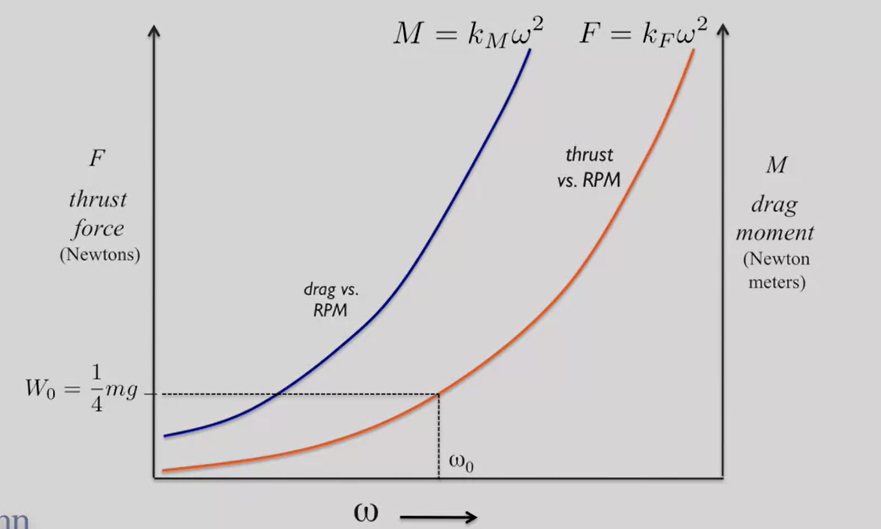
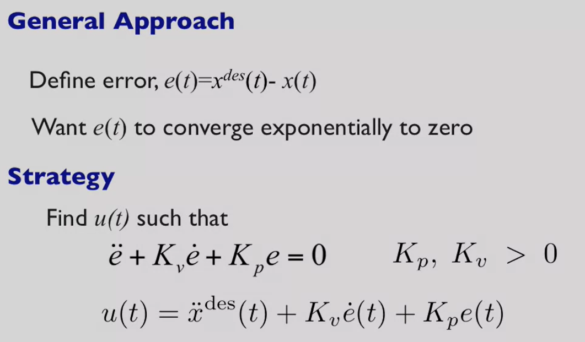
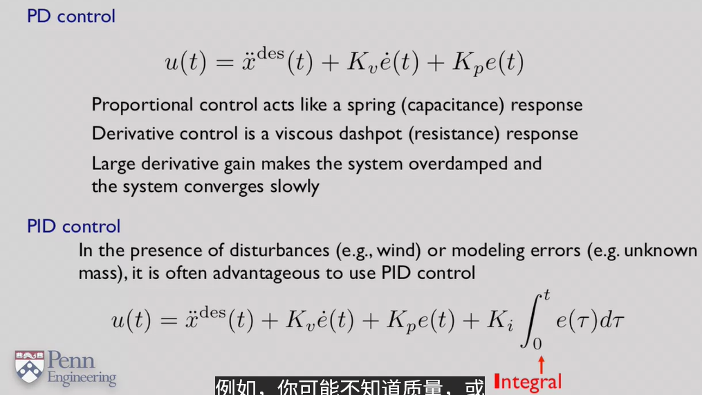
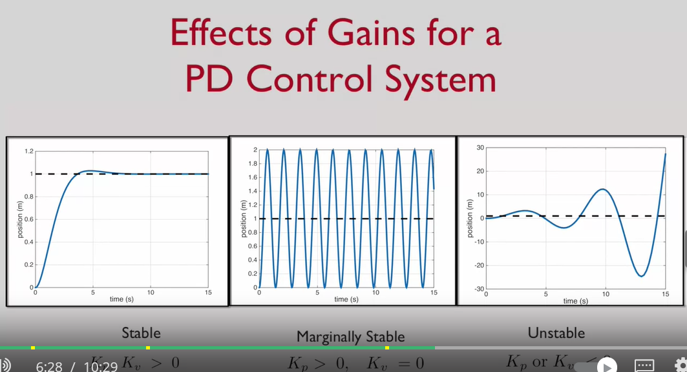
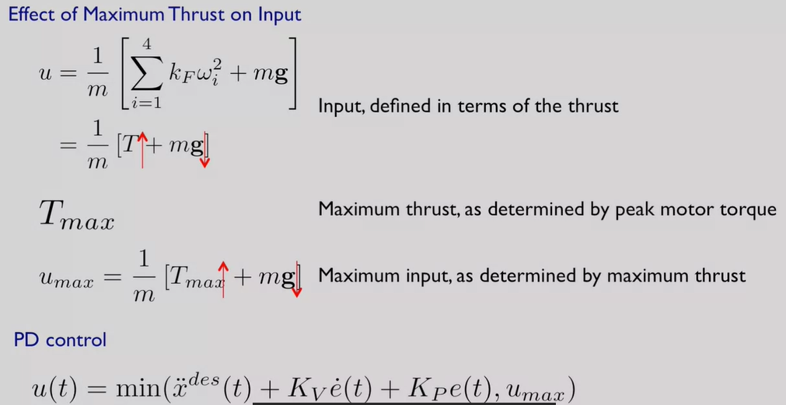
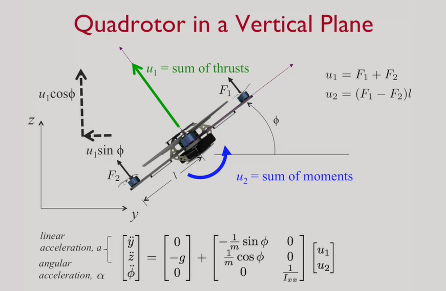
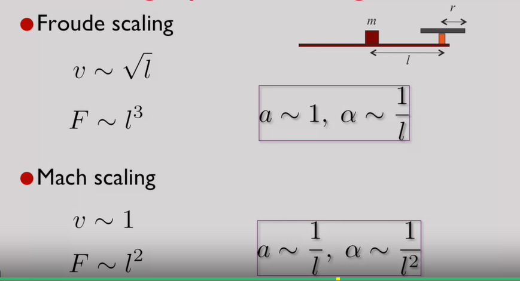

问题1 为什么有一个阻力？哪来的
# PD控制
https://www.guyuehome.com/35142

feedforward 

有未知量时用PID
kp kv大于零对PD控制就是指数收敛

Kp 会让系统更快的收敛，更有弹性
Try to play around with the two gains, K sub p and K sub v.
To achieve a simple goal, which is to get a desired response in which the rise time,
in other words the time taken to get to the desired position, is reasonably short.
And the overshoot is kept below some modest value. 

尝试调整两个增益，Kp和Kv。
实现一个简单的目标，即获得一个期望的响应，其中上升时间，换句话说，到达期望位置所需的时间，是相当短的。
并且超调保持在一些适度的值以下。
kp=100
kv=18
实际情况中力有最大值

推重比的影响

电池的选择
考虑功耗，以及电池总能量
    机器人非常低效
reduce the weight of the robot
四旋翼中电池占1/3的重量
添加组件不光考虑功耗，更要考虑重量（推重比消耗）

# 灵活度（Agility）
最大航速到静止的时间：减少制动距离
最大速度转向

线加速度最大化和角加速度最大化方法

部件 CPU 电池 传感器 电机
最大化推重比就是最大化加速度
传感器看的远，就可以达到更高的急速（因为减速距离变长了，但是看得远也变重了）

平台大小的影响
mass 惯性
最大推力~r^4([pi*r^2*(wr)^2])
惯性矩~l^5
力矩 F*l

froude scaling
mach scaling

