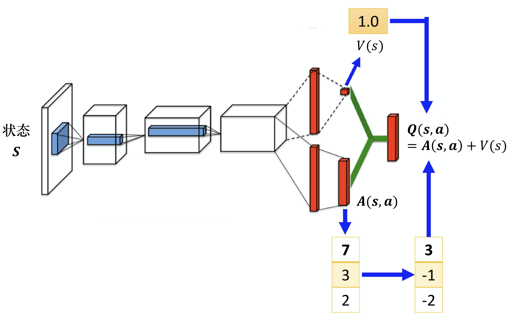

# 实验4 Rainbow
## 实验内容
1. 实现基本的DNQ
2. 实现DQN的改进算法：
    1. double_dqn的做法，是改进损失函数，防止估计偏高
    2. dueling_net做法，是改进网络结构，将Q值分解为状态值和动作值，更好的估计状态值
    3. prioritized_replay做法，是改进经验回放，将重要的经验放在回放池的前面，更好的利用经验
    4. n_step做法，是异步更新，更好的利用经验
    5. noisy_net做法，是改进网络结构，引入噪声，更好的探索，代替掉epsilon-greedy策略
    6. distributional_dqn做法，是改进网络结构，将Q值分解为概率分布，更好的估计Q值
3. 将以上算法合并到一个整体（各个算法互相不冲突），得到Rainbow算法

## 代码实现
主要参考了Rainbow is all you need 实现方法
### 1. 实现基本的DQN
算法伪代码：TODO

### 2. 实现DQN的改进算法
#### 2.1 double_dqn
改进在compute_loss（）中

原本的DQN使用会更新参数的网络进行选择和计算Q值，而double_dqn使用不会更新参数的网络进行计算，这样可以防止估计偏高

#### 2.2 dueling_net
不需要把所有的状态-动作对都采样，可以用比较高效的方式去估计 Q 值

当只更新了 V(s)的时候，只要修改 V(s)的值，Q表格的值也会被修改。所有的动作的 Q 值都会被修改

‵‵‵python

#### 2.3 prioritized_replay