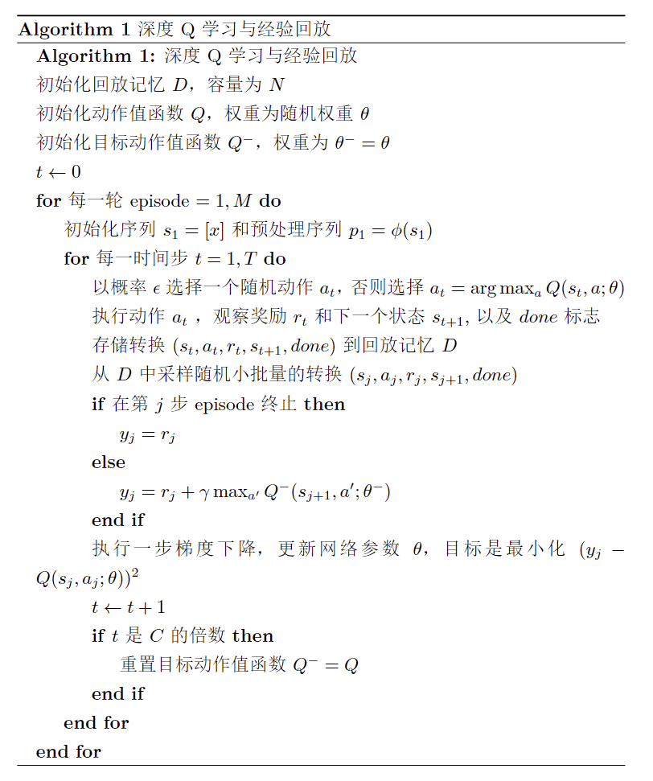
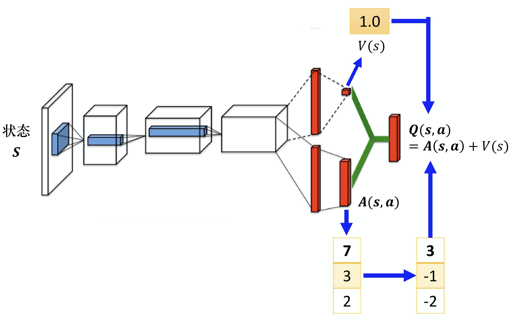
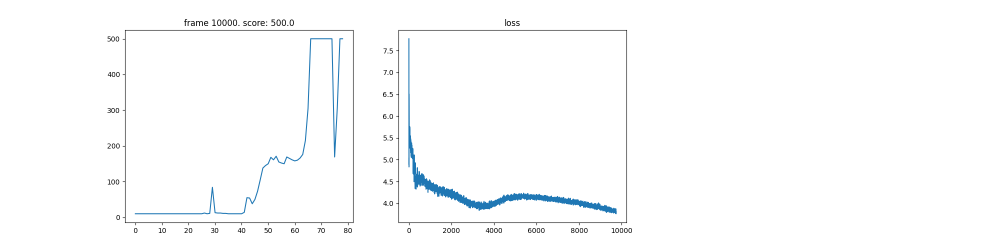

# 实验4 Rainbow
## 实验内容
1. 实现基本的DNQ
2. 实现DQN的改进算法：
    1. double_dqn的做法，是改进损失函数，防止估计偏高
    2. dueling_net做法，是改进网络结构，将Q值分解为状态值和动作值，更好的估计状态值
    3. prioritized_replay做法，是改进经验回放，将重要的经验放在回放池的前面，更好的利用经验
    4. n_step做法，是异步更新，更好的利用经验
    5. noisy_net做法，是改进网络结构，引入噪声，更好的探索，代替掉epsilon-greedy策略
    6. distributional_dqn做法，是改进网络结构，将Q值分解为概率分布，更好的估计Q值
3. 将以上算法合并到一个整体（各个算法互相不冲突），得到Rainbow算法

## 代码实现
主要参考了Rainbow is all you need 实现方法
### 1. 实现基本的DQN
算法伪代码：

### 2. 实现DQN的改进算法
#### 2.1 double_dqn
改进在compute_loss（）中

原本的DQN使用会更新参数的网络进行选择和计算Q值，而double_dqn使用不会更新参数的网络进行计算，这样可以防止估计偏高

#### 2.2 dueling_net
不需要把所有的状态-动作对都采样，可以用比较高效的方式去估计 Q 值

当只更新了 V(s)的时候，只要修改 V(s)的值，Q表格的值也会被修改。所有的动作的 Q 值都会被修改



```Python
def forward(self, x: torch.Tensor) -> torch.Tensor:
        """Forward method implementation."""
        feature = self.feature_layer(x)
        
        value = self.value_layer(feature)
        advantage = self.advantage_layer(feature)
        # print(value.shape, advantage.shape, advantage.mean(dim=-1, keepdim=True).shape)
        q = value + advantage - advantage.mean(dim=-1, keepdim=True)
        # 6 4 3  -[5.5 3.5  2]
        # 5 3 1 
        return q
```

#### 2.3 prioritized_replay
buffer改了，同时用到了线段树来实现改变优先级

重点在增加权重beta

```Python
    # PER: increase beta
            fraction = min(frame_idx / num_frames, 1.0)
            self.beta = self.beta + fraction * (1.0 - self.beta)
```

#### 2.4 n_step
异步更新，更好的利用经验，更快的学习

$$
R^{(n)}_t = \sum_{k=0}^{n-1} \gamma_t^{(k)} R_{t+k+1}.
$$

$$
(R^{(n)}_t + \gamma^{(n)}_t \max_{a'} q_{\theta}^{-}
(S_{t+n}, a')
- q_{\theta}(S_t, A_t))^2.
$$

#### 2.5 noisy_net
改进在网络结构上，引入噪声
```Python
class NoisyLinear(nn.Module):
    """Noisy linear module for NoisyNet.
    
    Attributes:
        in_features (int): input size of linear module
        out_features (int): output size of linear module
        std_init (float): initial std value
        weight_mu (nn.Parameter): mean value weight parameter
        weight_sigma (nn.Parameter): std value weight parameter
        bias_mu (nn.Parameter): mean value bias parameter
        bias_sigma (nn.Parameter): std value bias parameter
        
    """

    def __init__(self, in_features: int, out_features: int, std_init: float = 0.5):
        """Initialization."""
        super(NoisyLinear, self).__init__()
        
        self.in_features = in_features
        self.out_features = out_features
        self.std_init = std_init

        self.weight_mu = nn.Parameter(torch.Tensor(out_features, in_features))
        self.weight_sigma = nn.Parameter(
            torch.Tensor(out_features, in_features)
        )
        self.register_buffer(
            "weight_epsilon", torch.Tensor(out_features, in_features)
        )

        self.bias_mu = nn.Parameter(torch.Tensor(out_features))
        self.bias_sigma = nn.Parameter(torch.Tensor(out_features))
        self.register_buffer("bias_epsilon", torch.Tensor(out_features))

        self.reset_parameters()
        self.reset_noise()

    def reset_parameters(self):
        """Reset trainable network parameters (factorized gaussian noise)."""
        mu_range = 1 / math.sqrt(self.in_features)
        self.weight_mu.data.uniform_(-mu_range, mu_range)
        self.weight_sigma.data.fill_(
            self.std_init / math.sqrt(self.in_features)
        )
        self.bias_mu.data.uniform_(-mu_range, mu_range)
        self.bias_sigma.data.fill_(
            self.std_init / math.sqrt(self.out_features)
        )

    def reset_noise(self):
        """Make new noise."""
        epsilon_in = self.scale_noise(self.in_features)
        epsilon_out = self.scale_noise(self.out_features)

        # outer product
        self.weight_epsilon.copy_(epsilon_out.ger(epsilon_in))
        self.bias_epsilon.copy_(epsilon_out)

    def forward(self, x: torch.Tensor) -> torch.Tensor:
        """Forward method implementation.
        
        We don't use separate statements on train / eval mode.
        It doesn't show remarkable difference of performance.
        """
        return F.linear(
            x,
            self.weight_mu + self.weight_sigma * self.weight_epsilon,
            self.bias_mu + self.bias_sigma * self.bias_epsilon,
        )
    
    @staticmethod
    def scale_noise(size: int) -> torch.Tensor:
        """Set scale to make noise (factorized gaussian noise)."""
        x = torch.randn(size)

        return x.sign().mul(x.abs().sqrt())

```
同时，在更新完参数后，需要重新生成噪声
```Python
   # NoisyNet: reset noise
        self.dqn.reset_noise()
        self.dqn_target.reset_noise()
```

在这个算法中，batch_size大一点会比较有效

#### 2.6 distributional_dqn
```Python
def forward(self, x: torch.Tensor) -> torch.Tensor:
        """Forward method implementation."""
        dist = self.dist(x)
        q = torch.sum(dist * self.support, dim=2)
        
        return q
    
    def dist(self, x: torch.Tensor) -> torch.Tensor:
        """Get distribution for atoms."""
        q_atoms = self.layers(x).view(-1, self.out_dim, self.atom_size)
        dist = F.softmax(q_atoms, dim=-1)
        dist = dist.clamp(min=1e-3)  # for avoiding nans
        
        return dist
```

### 3. 将以上算法合并到一个整体
见rainbow.py

## 实验结果


可以看到，Rainbow可以完美的做到500分，和此前实验的PPO效果相当

## 实验总结

Rainbow算法是DQN的一个改进，将多种改进方法结合在一起，可以得到更好的效果

在时间上耗费较长，但优于PPO

时间原因，没有仔细调参，只调了最后的Rainbow的参数，分步的算法没有调参，只是跑起来就行了。