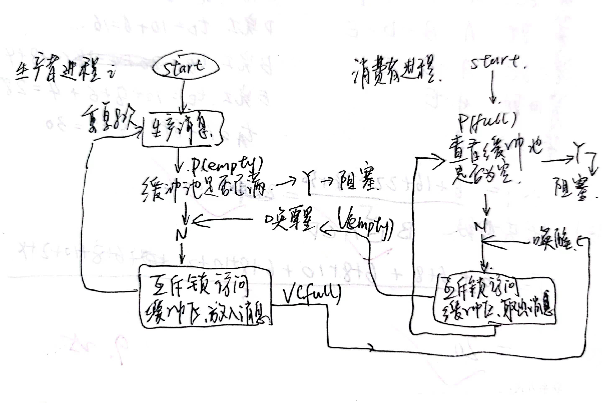
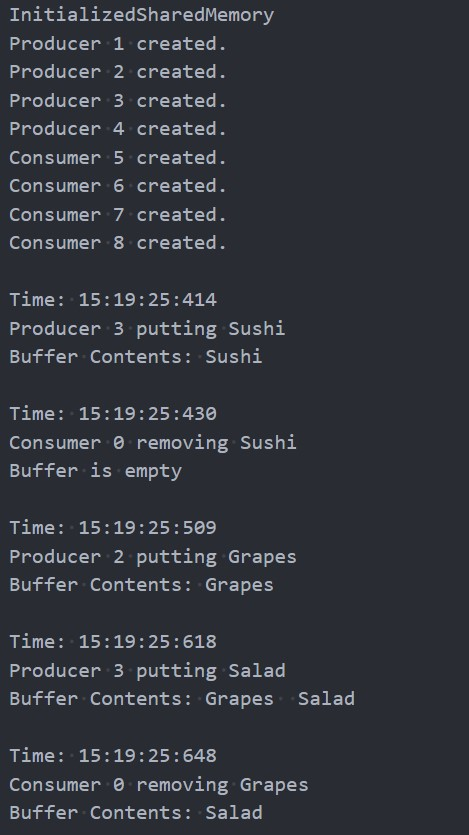

# 操作系统实验 进程管理（生产者-消费者问题）
马煜 1120210526
## 实验要求
- 创建一个有6个缓冲区的缓冲池，初始为空，每个缓冲区能存放一个长度若为10个字符的字符串。
- 4个生产者进程
    - 随机等待一段时间，往缓冲区添加数据
    - 若缓冲区已满，等待消费者取走数据后再添加
    - 重复8次
- 4个消费者进程
    - 随机等待一段时间，从缓冲区读取数据
    - 若缓冲区为空，等待生产者添加数据后再读取
    - 重复8次
- 在Windows平台上做。
- 显示每次添加或读取数据的时间及缓冲区的映像。
- 生产者和消费者用进程模拟。

## 实验目的
编写程序，解决生产者与消费者问题，理解进程的互斥与同步。

## 实验原理
消费者生产者示意图


可以从图中看出，本实验使用了三个信号量
```c++
HANDLE empty = CreateSemaphore(NULL, 6, 6, "EMPTY");
HANDLE full = CreateSemaphore(NULL, 0, 6, "FULL");
HANDLE mutex = CreateMutex(NULL, FALSE, "MUTEX");
```
分别用来表示剩余缓冲池数量，缓冲池中产品数量，以及用来控制缓冲池互斥访问的互斥锁。

### 以下是我自己对信号量的理解表述
># 信号量
>一般初始化为该资源的初始值

>和互斥信号量mutex的区别

>互斥信号量是二进制信号量，用于互斥访问。
># P操作
>将信号量减一（使用）

>如果信号量大于等于0，意味着有剩余或刚好用完，可以继续执行

>如果信号量小于0，意味着没有剩余，需要等待
>调用P操作的进程的状态就变成阻塞状态，并且把进程送到相应的等待队列的末尾，cpu重新调度。

># V操作
>将信号量加一（释放/生产）
>如果信号量大于0，意味着队列里没东西，直接继续执行
>如果信号量小于等于0，意味着队列里有东西，需要唤醒等待队列里的一个进程（使用自己留下的空位），自己则继续执行
### 对windows函数的解释见附录1

## 实验代码
具体代码见对应文件
### mayu.h
我将缓冲区的定义和封装好的缓冲区类（创建，初始化，删除方法）、子进程的类（创建和删除）写在了mayu.h头文件中。封装的目的本来是打算在消费者和生产者进程中复用函数，但其实后来发现因为缓冲区是用windows系统的函数实现的共享，因此子进程对缓冲区的操作不能用封装的类。

我使用如下代码将缓冲区定义为了带有head,tail,is_empty的数据类型
```c++
#define BUFFER_SIZE 6
typedef char Bffer[10];
typedef struct sharedmemory
{
    Bffer s[BUFFER_SIZE];
    int head;
    int tail;
    int is_empty;
} SHM;
```
使用`CreateFileMapping()`创建共享内存，使用`MapViewOfFile()`将共享内存映射到进程的地址空间中，使用`UnmapViewOfFile()`解除映射，使用`CloseHandle()`关闭文件映射对象。

在从初始化`void InitializeSharedMemory()`中，我初始化了`empty,full,mutex`信号量

创建子程序部分，使用`CreateProcess(FileName, Cmd, NULL, NULL, FALSE, 0, NULL, NULL, &si, &subProcess[i])`创建，cmd命令告知子程序他的编号（不使用`GetCurrentProcessId()`是因为它可读性不好。

### main.cpp
因为引入头文件，主程序很简洁
```c++
#define NUM_PRODUCER 4
#define NUM_CONSUMER 4
//定义生产者和消费者的数量

int main()
{
    ShareBuffer shareBuffer; //创建共享内存对象
    shareBuffer.CreateSharedMemory(); //创建共享内存
    shareBuffer.InitializeSharedMemory(); //初始化共享内存
    SubProcessManager subProcess1(NUM_CONSUMER, NUM_PRODUCER); //创建子进程管理器
    subProcess1.CreateSubProcess();//创建子进程
    subProcess1.CloseSubProcess();//关闭子进程
    return 0;
}
```
### c.cpp
这个文件是消费者部分，为了使代码的PV操作更加明显，我通过
```c++
#define P WaitForSingleObject
#define Vs ReleaseSemaphore
#define Vm ReleaseMutex
```
来代替`WaitForSingleObject`和`ReleaseSemaphore`，`ReleaseMutex`函数。

消费者部分的代码核心部分是
```c++
for (int i = 0; i < TIMES_OF_CONSUMER; i++)
    {
        // 随机睡很久
        srand(GetCurrentProcessId() + i);
        Sleep(rand() % 2000);
        P(full, INFINITE);
        P(mutex, INFINITE);

        SYSTEMTIME time;
        GetLocalTime(&time);
        printf("\nTime: %02d:%02d:%02d:%d\n", time.wHour, time.wMinute, time.wSecond, time.wMilliseconds);
        printf("Consumer %d removing %s\n", programNumber, addr->s[addr->head]);

        addr->head = (addr->head + 1) % BUFFER_SIZE;
        if (addr->head == addr->tail)
        {
            addr->is_empty = 1;
        }
        else
        {
            addr->is_empty = 0;
        }
        PrintBufferContents(addr);
        Vm(mutex);
        Vs(empty, 1, NULL);
    }
```
可以很清晰的看到我们的PV操作，`P(full, INFINITE)`表示等待缓冲区有产品，`P(mutex, INFINITE)`表示等待互斥锁，`Vm(mutex)`表示释放互斥锁，`Vs(empty, 1, NULL)`表示释放一个空位。

### p.cpp
生产者部分的代码和消费者很相似，不过多赘述了。

## 实验结果

实验结果的完整文本输出可以在`result.txt`中查看

可以看到，我的代码完美的解决了生产者和消费者的问题

# 附录1：对用到的函数和变量常量解释
## HANDLE
`HANDLE` 是 Windows 操作系统中用于表示句柄（Handle）的数据类型。句柄是一种用来标识和引用资源的抽象数据类型，这些资源可以是文件、内存、窗口、线程、进程、设备等等。`HANDLE` 数据类型通常用于在 Windows 编程中引用和操作这些资源。

句柄是一种整数值，但它们通常是不透明的，也就是不能直接访问其内部结构。开发者通过操作系统提供的函数来创建、使用和关闭句柄，这些函数接受 `HANDLE` 类型作为参数，允许程序与操作系统资源进行交互。

一些常见的句柄类型包括：

1. **文件句柄（File Handle）**：用于表示文件，包括文本文件、二进制文件、设备文件等。

2. **进程句柄（Process Handle）**：用于表示进程，允许控制和与其他进程进行通信。

3. **线程句柄（Thread Handle）**：用于表示线程，允许控制和与线程进行通信。

4. **窗口句柄（Window Handle）**：用于表示图形用户界面 (GUI) 窗口，允许操作窗口、消息处理等。

5. **事件句柄（Event Handle）**：用于表示同步事件，用于线程之间的同步。

6. **互斥体句柄（Mutex Handle）**：用于表示互斥体，用于线程之间的互斥同步。

7. **信号量句柄（Semaphore Handle）**：用于表示信号量，用于控制对资源的访问。

8. **共享内存句柄（Shared Memory Handle）**：用于表示共享内存区域，允许多个进程共享内存。

`HANDLE` 是一个通用的数据类型，它的具体含义取决于上下文和所涉及的资源类型。在 Windows 编程中，开发者通常需要使用合适的函数来创建、操作和关闭句柄，以有效地管理系统资源。

## LPVOID
`LPVOID` 是 Windows 编程中使用的数据类型，它是一个指向 `void` 的指针类型，通常用于表示不特定类型的指针。"LP" 的前缀表示 "Long Pointer"，它是一种传统的命名约定，用于指示指向内存的指针。`LPVOID` 类型通常在 Windows API 中用于处理各种类型的指针，因为它可以指向不同类型的数据。

在 Windows 编程中，`LPVOID` 通常用于以下情况：

1. **内存分配和释放**：`LPVOID` 可以用来接收动态内存分配函数（如 `malloc` 或 `HeapAlloc`）的返回值。这使得它可以指向分配的内存块，然后在不同数据类型之间进行类型转换。

2. **参数传递**：一些 Windows API 函数的参数可以接受 `LPVOID` 类型的指针，以允许这些函数操作不同类型的数据。

3. **处理文件或内存映射**：`LPVOID` 可用于处理文件或内存映射，以读取或写入数据。

4. **回调函数**：在某些情况下，回调函数可能需要接受 `LPVOID` 参数，以允许回调函数处理不同类型的数据。

5. **处理通用数据**：当你需要一个通用指针类型来处理不同数据类型的指针时，`LPVOID` 可能非常有用。

需要注意的是，使用 `LPVOID` 会丧失编译器的类型检查，因此在使用它时需要小心确保数据类型的正确性。通常需要在使用前进行类型转换。在 Windows 编程中，`LPVOID` 通常用于处理底层操作系统级别的数据结构和资源。

## INVALID_HANDLE_VALUE
`INVALID_HANDLE_VALUE` 是一个 Windows 定义的特殊常量，它表示无效的句柄值。在 Windows 编程中，句柄（`HANDLE`）通常用于标识和引用资源，如文件、进程、线程、窗口等。`INVALID_HANDLE_VALUE` 用于表示一个句柄未被分配或无效。

通常，`INVALID_HANDLE_VALUE` 用于初始化或检查句柄是否有效。当你尝试创建或打开一个资源（例如文件、进程等）时，如果操作失败，操作系统会将句柄设置为 `INVALID_HANDLE_VALUE`。

以下是一些示例用法：

1. **创建或打开文件**：

   ```cpp
   HANDLE hFile = CreateFile(L"example.txt", GENERIC_READ, 0, NULL, OPEN_EXISTING, FILE_ATTRIBUTE_NORMAL, NULL);
   if (hFile == INVALID_HANDLE_VALUE) {
       // 文件打开失败
   }
   ```

   在这个示例中，`CreateFile` 函数返回 `INVALID_HANDLE_VALUE` 表示文件打开失败。

2. **关闭句柄**：

   ```cpp
   if (hFile != INVALID_HANDLE_VALUE) {
       CloseHandle(hFile);
   }
   ```

   在这个示例中，检查句柄是否有效，然后关闭句柄。

3. **共享内存的创建**：

   ```cpp
   HANDLE hMapping = CreateFileMapping(INVALID_HANDLE_VALUE, NULL, PAGE_READWRITE, 0, sizeof(struct sharedmemory), "BUFFER");
   if (hMapping == NULL) {
       // 文件映射对象创建失败
   }
   ```

   在这个示例中，`CreateFileMapping` 在创建文件映射对象时使用 `INVALID_HANDLE_VALUE`，表示它不依赖于已存在的文件。

使用 `INVALID_HANDLE_VALUE` 是一种通用的做法，用于初始化句柄并检查句柄的有效性。当你需要检查或初始化句柄时，可以使用 `INVALID_HANDLE_VALUE` 来表示未分配的或无效的句柄。
## CreateFileMapping()
在 Windows 操作系统中，`CreateFileMapping()` 函数用于创建文件映射对象。文件映射对象是一种允许多个进程共享内存区域的机制，这个内存区域可以映射到磁盘文件或物理内存。

以下是对 `CreateFileMapping()` 函数的中文解释、函数定义以及一个示例：

**中文解释**:
`CreateFileMapping()` 函数用于创建文件映射对象，它可以在多个进程之间共享内存。这个函数通常用于实现共享内存的机制，多个进程可以将同一块内存映射到它们的地址空间中，以便它们可以相互通信和共享数据。

**函数定义**:
```c
HANDLE CreateFileMapping(
  HANDLE                hFile,                 // 文件句柄或无效句柄
  LPSECURITY_ATTRIBUTES  lpAttributes,          // 安全性描述符
  DWORD                 flProtect,             // 访问控制属性
  DWORD                 dwMaximumSizeHigh,     // 文件大小的高位字节
  DWORD                 dwMaximumSizeLow,      // 文件大小的低位字节
  LPCTSTR               lpName                 // 文件映射对象的名称
);
```

**使用示例**:
以下是一个简单示例，演示如何使用 `CreateFileMapping()` 函数来创建一个文件映射对象，并将其映射到进程的地址空间中：

```c
#include <windows.h>
#include <stdio.h>

int main() {
    HANDLE hFileMapping;
    LPVOID pMemory;
    char* pData = "Hello, shared memory!";

    // 创建文件映射对象
    hFileMapping = CreateFileMapping(
        INVALID_HANDLE_VALUE,   // 无文件句柄，创建匿名映射
        NULL,                   // 安全性描述符（使用默认值）
        PAGE_READWRITE,         // 读写权限
        0,                      // 文件大小的高位字节
        256,                    // 文件大小的低位字节 (256字节)
        TEXT("MySharedMemory")  // 映射对象的名称
    );

    if (hFileMapping == NULL) {
        printf("无法创建文件映射对象.\n");
        return 1;
    }

    // 将文件映射对象映射到进程的地址空间中
    pMemory = MapViewOfFile(hFileMapping, FILE_MAP_WRITE, 0, 0, 0);

    if (pMemory == NULL) {
        printf("无法映射文件映射对象到地址空间.\n");
        CloseHandle(hFileMapping);
        return 1;
    }

    // 将数据写入共享内存
    strcpy((char*)pMemory, pData);
    printf("数据已写入共享内存.\n");

    // 关闭文件映射对象和解除映射
    UnmapViewOfFile(pMemory);
    CloseHandle(hFileMapping);

    return 0;
}
```

在上述示例中，我们使用 `CreateFileMapping()` 创建了一个文件映射对象，然后使用 `MapViewOfFile()` 将它映射到进程的地址空间中。这使得进程可以在共享内存区域中写入数据，其他进程也可以映射同一个文件映射对象并读取这些数据。最后，我们释放了映射的内存区域并关闭文件映射对象。

## MapViewOfFile()
`MapViewOfFile` 是 Windows API 中的一个函数，它用于将文件映射对象映射到当前进程的地址空间，从而允许进程访问共享内存或共享文件数据。这个函数通常与文件映射对象一起使用，以便进程能够读取或写入文件映射对象所表示的共享内存或文件数据。

以下是 `MapViewOfFile` 函数的声明和主要参数：

```cpp
LPVOID MapViewOfFile(
  HANDLE hFileMappingObject,  // 文件映射对象的句柄
  DWORD dwDesiredAccess,      // 访问权限标志
  DWORD dwFileOffsetHigh,    // 文件偏移的高位部分
  DWORD dwFileOffsetLow,     // 文件偏移的低位部分
  SIZE_T dwNumberOfBytesToMap // 映射的字节数
);
```

- `hFileMappingObject`：要映射的文件映射对象的句柄，通常由 `CreateFileMapping` 或 `OpenFileMapping` 返回。

- `dwDesiredAccess`：访问权限标志，指定映射对象的访问方式，如 `FILE_MAP_READ`、`FILE_MAP_WRITE` 或 `FILE_MAP_ALL_ACCESS`。

- `dwFileOffsetHigh` 和 `dwFileOffsetLow`：文件偏移，用于指定从文件映射对象的哪个位置开始映射。

- `dwNumberOfBytesToMap`：要映射的字节数。

`MapViewOfFile` 函数返回一个指向映射区域的指针 (`LPVOID`)，你可以使用这个指针来访问共享内存或文件数据。这个指针通常指向一个缓冲区，你可以在该缓冲区中进行读取或写入操作。

在使用 `MapViewOfFile` 函数时，需要谨慎管理内存，确保在不再需要映射区域时调用 `UnmapViewOfFile` 函数来解除映射。这有助于防止内存泄漏和资源泄漏。

示例用法：

```cpp
HANDLE hFileMapping = CreateFileMapping(
    INVALID_HANDLE_VALUE,
    NULL,
    PAGE_READWRITE,
    0,
    1024,  // 映射的字节数
    "MySharedMemory");

LPVOID pData = MapViewOfFile(
    hFileMapping,
    FILE_MAP_WRITE,
    0,
    0,
    1024);

// 使用 pData 进行共享内存的读取或写入操作

UnmapViewOfFile(pData);
CloseHandle(hFileMapping);
```

在上述示例中，`CreateFileMapping` 创建了一个文件映射对象，然后 `MapViewOfFile` 将文件映射对象映射到当前进程的地址空间。之后，你可以使用 `pData` 来访问共享内存的数据。最后，通过调用 `UnmapViewOfFile` 和 `CloseHandle` 来释放资源。
## CreateProcess()
`CreateProcess()` 是 Windows 操作系统提供的一个函数，用于创建一个新的进程（程序的实例）。以下是对该函数的中文解释、函数定义和一个简单的使用样例：

**中文解释**:
`CreateProcess()` 函数用于在 Windows 操作系统上创建新的进程。它接受一些参数，包括要执行的可执行文件的路径、命令行参数、进程的安全性描述、启动选项等。该函数将创建一个新的进程并开始执行指定的可执行文件。这个函数通常用于在一个程序中启动另一个程序，或者在需要时启动外部应用程序。

**函数定义**:
```c
BOOL CreateProcess(
  LPCTSTR lpApplicationName, // 可执行文件的路径
  LPTSTR lpCommandLine,      // 命令行参数
  LPSECURITY_ATTRIBUTES lpProcessAttributes, // 进程安全性描述
  LPSECURITY_ATTRIBUTES lpThreadAttributes,  // 线程安全性描述
  BOOL bInheritHandles,      // 是否继承句柄
  DWORD dwCreationFlags,     // 创建标志
  LPVOID lpEnvironment,      // 进程环境块
  LPCTSTR lpCurrentDirectory, // 当前工作目录
  LPSTARTUPINFO lpStartupInfo, // 启动信息
  LPPROCESS_INFORMATION lpProcessInformation // 进程信息
);
```

**使用样例**:
以下是一个使用 `CreateProcess()` 函数启动记事本应用程序的简单示例。

```c
#include <windows.h>

int main() {
    // 定义结构体变量来保存进程信息
    PROCESS_INFORMATION pi;
    
    // 定义启动信息结构体并初始化
    STARTUPINFO si;
    ZeroMemory(&si, sizeof(STARTUPINFO));
    si.cb = sizeof(STARTUPINFO);

    // 启动记事本应用程序
    if (CreateProcess(
        TEXT("notepad.exe"),    // 可执行文件的路径
        NULL,                   // 命令行参数
        NULL,                   // 进程安全性描述
        NULL,                   // 线程安全性描述
        FALSE,                  // 不继承句柄
        0,                      // 创建标志
        NULL,                   // 进程环境块
        NULL,                   // 当前工作目录
        &si,                    // 启动信息
        &pi                     // 进程信息
    )) {
        // 成功创建进程
        WaitForSingleObject(pi.hProcess, INFINITE); // 等待进程退出
        CloseHandle(pi.hProcess); // 关闭进程句柄
        CloseHandle(pi.hThread);  // 关闭线程句柄
    } else {
        // 创建进程失败
        printf("无法启动记事本应用程序。\n");
    }
    
    return 0;
}
```

此示例中，`CreateProcess()` 用于启动记事本应用程序，并等待它退出。如果成功创建进程，它会打开记事本，否则会输出错误消息。

## PROCESS_INFORMATION
`PROCESS_INFORMATION` 是一个结构体，通常用于在 Windows 程序中获取关于新进程的信息，特别是进程句柄和线程句柄。这个结构体通常包含以下成员：

1. `hProcess`：进程句柄（`HANDLE` 类型）。这是新进程的句柄，允许您与该进程进行交互，例如等待它的结束、关闭它等。

2. `hThread`：主线程句柄（`HANDLE` 类型）。这是新进程的主线程的句柄，您可以使用它来与主线程进行交互，监视它的状态等。

3. `dwProcessId`：进程标识符（`DWORD` 类型）。这是新进程的唯一标识符，您可以使用它来区分不同的进程。

4. `dwThreadId`：线程标识符（`DWORD` 类型）。这是新进程的主线程的标识符，可用于区分不同的线程。

通常，`CreateProcess` 函数会填充这个结构体中的成员，以便您在主程序中可以访问新进程的相关信息。例如，您可以使用 `hProcess` 进行等待、关闭进程，使用 `hThread` 进行线程操作等。

示例用法：

```cpp
PROCESS_INFORMATION pi;
ZeroMemory(&pi, sizeof(PROCESS_INFORMATION));

if (CreateProcess(szFilename, szCmdLine, NULL, NULL, FALSE, 0, NULL, NULL, &si, &pi))
{
    // 新进程创建成功，可以使用 pi 中的信息
    // 例如，可以使用 pi.hProcess 进行等待或关闭进程
    // 也可以使用 pi.hThread 进行线程操作
}
```

在上述示例中，`pi` 是一个 `PROCESS_INFORMATION` 结构体，`CreateProcess` 创建了一个新进程，并将有关新进程的信息填充到了 `pi` 结构体中。这允许主程序与新进程进行交互和管理。
## TCHAR
`TCHAR` 是在 Windows 程序开发中广泛使用的一种数据类型定义。它是一个通用字符类型定义，可以在不同的编译环境下表示不同字符类型，具体取决于编译器和编译器选项。

`TCHAR` 的特点是它可以根据编译环境自动适应宽字符或窄字符。在 Windows 上，有两种主要的字符类型：

1. **窄字符**：使用单字节字符编码，通常是ASCII字符或ANSI字符。在 Windows 中，这些字符以 `char` 类型表示。

2. **宽字符**：使用多字节字符编码，通常是Unicode字符。在 Windows 中，这些字符以 `wchar_t` 类型表示。

为了编写可移植的代码，可以使用 `TCHAR` 来定义字符变量。在不同编译环境下，`TCHAR` 会根据配置自动映射到 `char` 或 `wchar_t`。这有助于编写能够在不同环境中正常工作的代码。

例如，您可以使用 `TCHAR` 来声明字符串：

```cpp
TCHAR szText[] = _T("Hello, World!");
```

在上述示例中，`szText` 可以在不同编译环境下适应窄字符或宽字符。这样，您的代码可以同时在不同的 Windows 编译环境中工作，而无需大规模更改。

需要注意的是，在现代 Windows 开发中，通常更倾向于使用Unicode字符（宽字符），因为它们支持更多的字符集和国际化。但是，某些传统的 Windows API 函数仍然使用 ANSI 字符，因此 `TCHAR` 仍然在一些旧的代码中被广泛使用。
# 主要参考文献
https://learn.microsoft.com/en-us/windows/win32/memory/creating-named-shared-memory?redirectedfrom=MSDN.